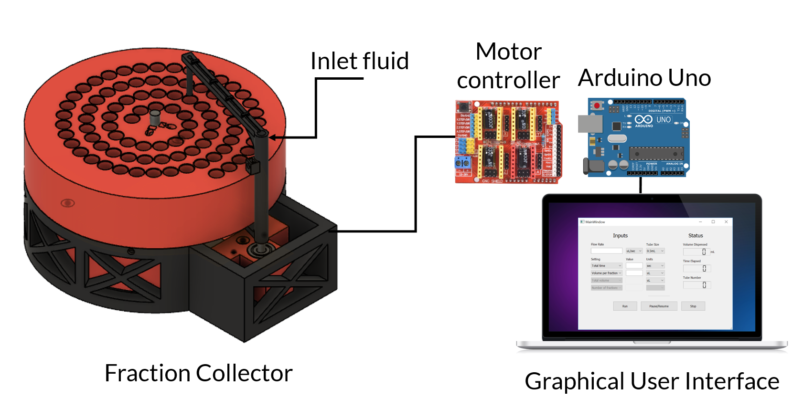



#### Overview

Fraction collection during fast protein liquid chromatography (FPLC) is performed with fraction collectors, which are rotating racks loaded with containers for collecting fixed volumes. Fraction collectors are also useful for microfluidics, and can be generally applied to tasks where aliquots need to be gathered, and where manual labor can be tedious and introduce human error. Most laboratories currently rely on commercial fraction collectors, which can be prohibitively expensive, and are difficult to customize. To facilitate custom applications, and to reduce cost, a number of open-source fraction collectors have been developed. These devices, while open and less expensive, still suffer from overengineering which drives costs higher, lengthens the assembly process, and introduces complexity in operation.

We have designed and built a simple, low-cost, and modular fraction collector that is easy to build and use. Our consists of four 3D printed components, one stepper motor, two shafts, and hardware assembled and controlled with an Arduino, CNC motor shield, stepper motor driver and accompanying software. The colosseum fraction collector differs from recent open-source fraction collectors in that it is significantly less expensive, requires less tools to assemble, only two screwdrivers,  and differs from commercial systems in that it is significantly less expensive, open source, and modular.

{:class="img-responsive"}

#### License

coliseum is distributed under the [BSD 2-Clause License](https://github.com/pachterlab/poseidon/blob/release/LICENSE)

