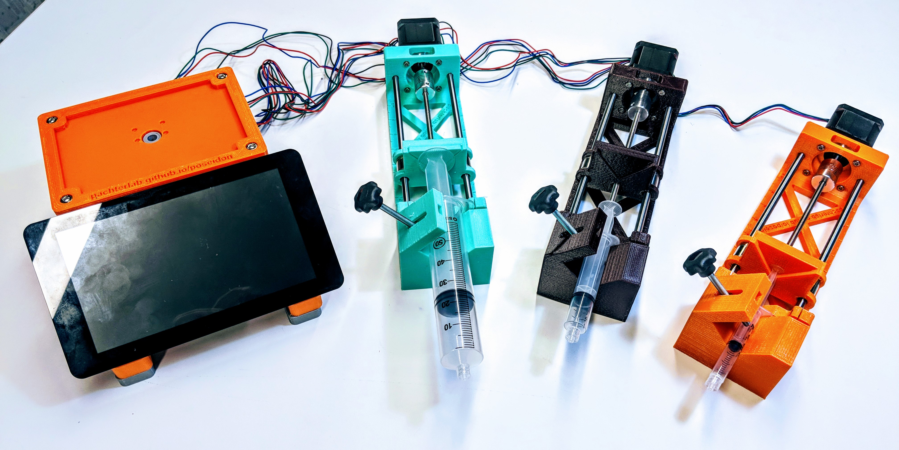



#### Overview

The poseidon syringe pump is an open source alternative to commercial systems. It costs less than $50 and can be assembled in under 20 minutes. The poseidon pump (poseidon v1) was originally designed for microfluidics applications such as droplet based single-cell RNA-seq, and was published in:

Booeshaghi, A. Sina, Eduardo da Veiga Beltrame, Dylan Bannon, Jase Gehring, and Lior Pachter. "[Principles of open source bioinstrumentation applied to the poseidon syringe pump system](https://www.nature.com/articles/s41598-019-48815-9)." Scientific reports 9, no. 1 (2019): 1-8

A second version of the pump (poseidon v2) is under design, and includes the option for several sensors, including end stops, a force-sensitive resistor, and a positional encoder. The revised pump is being developed in collaboration with [JOGL](https://app.jogl.io/) to undergo [testing and validation by AP-HP teams](https://app.jogl.io/project/185), The goal is to develop a medical grade syringe pump that can be used in intensive care units that require large number of syringe pumps to treat novel coronavirus patients.

{:class="img-responsive"}

#### License

poseidon is distributed under the [BSD 2-Clause License](https://github.com/pachterlab/poseidon/blob/release/LICENSE)

